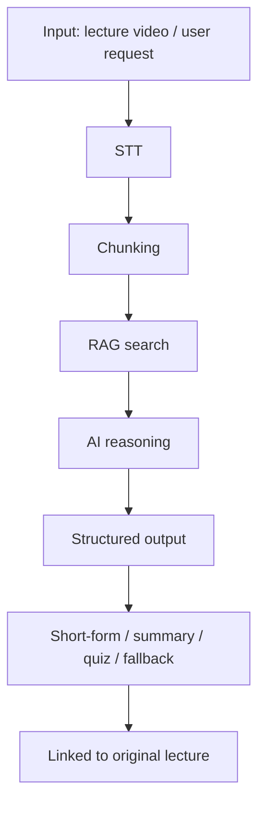

<p align="center">
  
</p>

<h3 align="center">An AI education platform that reconfigures lectures instead of just consuming them</h3>

<p align="center">
  AI analyzes lectures and extracts only the segments users need, creating a personalized learning experience.
</p>

---

## Overview

`MyWayClass` is an education platform that adds an AI layer on top of a traditional LMS and restructures lectures by meaning, not by video length.

This repository is the organization hub for collaboration rules and automation.

- PR/MR templates
- Issue templates
- CODEOWNERS
- GitHub Actions workflows

## Problem

The limitation of online lectures is not content volume, but search cost.

- A 5-minute lecture often contains only 2 to 3 minutes of truly useful material
- Learners must replay the full video to find one concept
- Review costs grow as the number of lectures increases
- Fixed playback units make personalization difficult

The real problem is **search cost, not content**.

## Solution

Lectures are restructured through the following flow:

```text
Lecture video
  -> STT
  -> Chunking
  -> RAG retrieval
  -> AI reasoning
  -> Short-form / Summary / Quiz / Q&A
  -> Linked back to the original lecture
```

This produces:

- Exam prep: quickly review only the core segment
- Concept learning: reorganize around definitions
- Review: repeated learning through summaries and quizzes
- Sharing: reuse learning assets across learners

## Features

- AI-powered short-form generation
- Custom lecture assembly
- Q&A and summaries
- Quiz generation
- Learning progress management
- Short-form community and sharing

## Architecture



LMS and AI layers are separated so the learning flow can remain stable even without AI.

## AI Collaboration

This project uses AI through specification and validation, not prompt-only workflows.

### Working Rules

- Fix the objective, target, and acceptance criteria before starting work
- Keep instructions short, but make scope and references explicit
- Include file names and line numbers when asking for analysis
- Use documentation as the single source of truth
- Record rationale in `docs/dev-logs/` after each change

### Workflow

```text
Design -> Document -> Implement -> Validate -> Log
```

### Worktree Strategy

- Compare up to two options only when it is actually useful
- Compare by change size, file count, validation result, and structural fit
- Do not trust the first result blindly; verify that docs and code still match
- Record the selected option and rationale in `docs/dev-logs/`

### Instruction Format

```text
[GOAL]
State what to create or change in one line.

[INPUT]
- Current assumptions
- Existing files, entities, APIs, and rules

[SCOPE]
- What this task may change
- What it must not change

[TASK]
1. Concrete task 1
2. Concrete task 2
3. Concrete task 3

[CONSTRAINTS]
- Rules that must be respected
- Error handling, response shape, and separation rules

[OUTPUT]
- Final deliverables
- File types to create or update

[ACCEPTANCE CRITERIA]
- How completion is judged
- How runtime behavior is verified
```

### AI Role Separation

| Role | Tool | Responsibility |
|------|------|----------------|
| Design | Claude Opus | Architecture, module boundaries, high-level decisions |
| Implementation | Codex | Code changes, repetitive work, file-level edits |
| Reasoning | AI Provider Layer | STT, summaries, classification, quizzes, RAG-based responses |

### Why This Matters

LLMs are probabilistic systems, so the same input can produce different results.
That is why this project controls AI with:

- Spec-driven instructions
- Worktree-based A/B comparisons
- Type checking
- Fallback responses
- Documented decisions

The production inference path combines `demo`, `Ollama`, `Gemini`, and `Cloudflare AI STT` depending on the environment, following the documented fallback order.

## Repository Conventions

- `pull_request_template.md`: PR format
- `MERGE_REQUEST_TEMPLATE.md`: merge request format
- `ISSUE_TEMPLATE/`: bug, docs, feature, and refactor templates
- `CODEOWNERS`: path-based review responsibility
- `workflows/`: branch protection and automation checks

## Validation

- JSON parsing checks
- TypeScript type safety
- Fallback behavior checks
- Side-effect review
- Documentation updates alongside code changes

## Docs Structure

```text
docs/
├── project/
├── context/
├── conventions/
├── ai-context/
├── dev-logs/
└── structure/
```

## Summary

`MyWayClass` is not just an LMS for playing lectures. It is an AI education platform that recomposes lecture meaning units to improve learning efficiency.

This repository is the operational hub that locks that philosophy into collaboration rules and review automation.

## License

This project is an entry for the 2026 KIT Vibecoding Competition.
