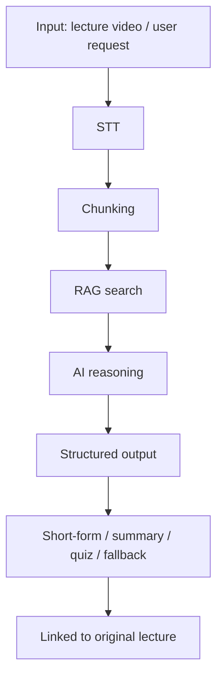

<p align="center">
  
</p>

<h3 align="center">강의를 “소비”가 아니라 “재구성”하는 AI 교육 플랫폼</h3>

<p align="center">
  AI 기반으로 강의를 분석하고, 필요한 구간만 추출해 개인화된 학습 경험을 제공합니다.
</p>

---

## Overview

`MyWayClass`는 기존 LMS 위에 AI 레이어를 얹어, 강의를 영상 단위가 아니라 의미 단위로 재구성하는 교육 플랫폼입니다.

이 레포는 프로젝트의 협업 기준과 자동화 규칙을 담는 조직 허브입니다.

- PR/MR 템플릿
- Issue 템플릿
- CODEOWNERS
- GitHub Actions 워크플로

## Problem

기존 온라인 강의의 한계는 콘텐츠 부족보다 탐색 비용에 있습니다.

- 5분짜리 영상에도 실제 필요한 구간은 2~3분인 경우가 많습니다
- 원하는 개념을 찾기 위해 전체 영상을 반복 재생해야 합니다
- 영상이 많아질수록 복습 경로가 길어집니다
- 고정된 재생 단위 때문에 개인화가 어렵습니다

핵심 문제는 **콘텐츠가 아니라 탐색 비용**입니다.

## Solution

강의를 다음 흐름으로 재구성합니다.

```text
Lecture video
  -> STT
  -> Chunking
  -> RAG retrieval
  -> AI reasoning
  -> Short-form / Summary / Quiz / Q&A
  -> Linked back to the original lecture
```

이 구조로 다음 결과를 만듭니다.

- 시험 대비: 핵심 구간만 빠르게 확인
- 개념 학습: 정의 중심으로 재구성
- 복습: 요약과 퀴즈 기반 반복 학습
- 공유: 수강생끼리 학습 자산을 재활용

## Features

- AI 기반 숏폼 자동 생성
- 커스텀 강의 조립
- 질문 응답 및 요약
- 퀴즈 자동 생성
- 학습 상태 관리
- 숏폼 커뮤니티 및 공유

## Architecture



LMS와 AI 레이어를 분리해, AI가 없더라도 기본 학습 흐름은 유지되도록 설계했습니다.

## AI Collaboration

이 프로젝트의 AI 협업 방식은 프롬프트 중심이 아니라, **명세와 검증으로 통제하는 방식**입니다.

### Working Rules

- 작업 전에는 목적을 먼저 고정합니다
- 지시는 짧게 쓰되, 범위와 완료 기준은 분명히 씁니다
- 문서는 단일 진실 원천으로 사용합니다
- 변경 후에는 `docs/dev-logs/`에 판단 근거를 남깁니다

### Workflow

```text
Design -> Document -> Implement -> Validate -> Log
```

### AI Role Separation

| Role | Tool | Responsibility |
|------|------|----------------|
| 설계 | Claude Opus | 아키텍처, 모듈 경계, 고수준 의사결정 |
| 구현 | Codex | 코드 수정, 반복 작업, 파일 단위 변경 |
| 추론 | AI Provider Layer | STT, 요약, 분류, 퀴즈, RAG 기반 응답 |

### Why This Matters

LLM은 확률 기반 시스템이라 같은 입력에도 결과가 달라질 수 있습니다.
그래서 이 프로젝트는 AI를 직접 믿는 대신, 다음으로 통제합니다.

- 명세 기반 지시
- A/B 워킹트리 비교
- 타입 검증
- fallback 응답
- 문서 기록

실제 서비스 추론 경로는 환경에 따라 `demo`, `Ollama`, `Gemini`, `Cloudflare AI STT`를 조합하고, 문서에 정의된 fallback 순서대로 동작합니다.

## Repository Conventions

- `pull_request_template.md`: PR 작성 기준
- `MERGE_REQUEST_TEMPLATE.md`: 머지 요청 기준
- `ISSUE_TEMPLATE/`: 버그, 문서, 기능, 리팩터링 이슈 템플릿
- `CODEOWNERS`: 경로별 리뷰 책임
- `workflows/`: 브랜치 보호와 자동 리뷰 체크

## Validation

- JSON 파싱 검증
- TypeScript 타입 안정성
- fallback 동작 확인
- 사이드 이펙트 점검
- 관련 문서 동시 갱신

## Docs Structure

```text
docs/
├── project/
├── context/
├── conventions/
├── ai-context/
├── dev-logs/
└── structure/
```

## Summary

`MyWayClass`는 강의를 단순히 재생하는 LMS가 아니라, 강의의 의미 단위를 다시 조합해 학습 효율을 높이는 AI 교육 플랫폼입니다.

이 레포는 그 철학을 실제 협업 규칙과 리뷰 자동화로 고정하는 운영 허브입니다.

## 라이선스

이 프로젝트는 2026 KIT 바이브코딩 공모전 출품작입니다.
