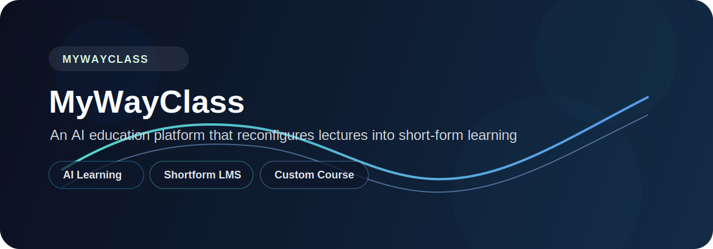

<p align="center">
  
</p>

<p align="center">
  강의를 개인화된 학습 자산으로 재구성하는 AI 교육 플랫폼
</p>

## 프로젝트 개요

`내맘대로`는 기본 LMS 위에 AI 레이어를 더해, 강의 콘텐츠를 더 짧고, 더 개인화되고, 더 재사용 가능한 형태로 바꾸는 차세대 교육 솔루션입니다.

이 프로젝트는 단순히 강의를 제공하는 데서 끝나지 않습니다. 학습자가 필요한 내용을 빠르게 복습하고, 교강사가 학습 흐름을 더 효율적으로 관리하며, 교육 운영자가 반복 업무를 줄일 수 있도록 설계되었습니다.

## 왜 이 프로젝트인가

교육 현장에는 콘텐츠 부족보다 구조의 비효율이 더 크게 작동합니다.

- 긴 강의를 다시 보기 어렵습니다.
- 학습자가 필요한 부분만 빠르게 복습하기 어렵습니다.
- 교강사는 자료 정리와 피드백 작성에 많은 시간을 씁니다.
- 운영자는 출결, 공지, 일정, 수강생 관리 같은 반복 업무를 계속 처리해야 합니다.

`내맘대로`는 이 문제를 AI로 풀기 위해 시작된 프로젝트입니다.

## 핵심 아이디어

- 강의 숏폼화
  - 강의 내용을 짧은 학습 단위로 재구성합니다.
- 커스텀 강의 조립
  - 여러 영상의 필요한 구간만 이어 붙여 개인화된 학습 흐름을 만듭니다.
- 같은 강의 수강생끼리의 공유와 담아가기
  - 같은 강사, 같은 강의, 실제 수강생이라는 범위 안에서만 학습 자산을 공유합니다.
- 기본 LMS와 분리된 AI 레이어
  - AI 기능은 별도 책임으로 분리해, LMS와 AI가 서로 독립적으로 동작하도록 합니다.

## 주요 기능

- 강의 요약과 복습 지원
- 질문응답과 학습 보조
- 숏폼 생성과 재구성
- 커스텀 강의 편집과 공유
- 수강 진행률과 학습 현황 관리
- 운영 업무 자동화 기반 구조

## 주요 사용자

- `학습자`
  - 필요한 구간만 빠르게 복습하고, 개인화된 흐름으로 학습합니다.
- `교강사`
  - 강의 운영과 피드백 과정을 더 효율적으로 관리합니다.
- `교육 운영자`
  - 수강생 관리와 공지, 일정, 진도 현황을 한 번에 파악합니다.

## 공모전 주제와의 연결

이 프로젝트는 `AI활용 차세대 교육 솔루션` 공모전의 방향과 맞닿아 있습니다.

- 단순한 온라인 교육 플랫폼(LMS) 구축에 국한하지 않습니다.
- 교강사, 수강생, 교육 운영자의 실질적인 페인 포인트를 해결합니다.
- AI를 통해 학습, 요약, 피드백, 운영, 재구성을 함께 다룹니다.

## 기술 방향

- 프론트엔드: `TypeScript`, `React`, `Vite`
- 백엔드: `TypeScript`, `Hono`, `Cloudflare Workers`
- 공통 계약: `packages/shared`
- 저장 및 배포: `Cloudflare D1`, `Cloudflare R2`, `Cloudflare Pages`

## 한 줄 소개

**강의를 숏폼과 커스텀 강의로 재구성하고, 같은 강의 수강생끼리 학습 자산을 공유하게 만드는 AI 교육 플랫폼**

## AI 협업 방식

우리는 AI를 단순한 질문 응답기가 아니라, 작업을 쪼개고 검증하고 비교하는 실무 파트너로 사용합니다.

### 기본 원칙

- 문서는 먼저 읽고, 코드는 그 다음에 만집니다.
- 컨벤션과 작업 지시는 섞지 않습니다.
- 컨벤션은 `myway-class/docs/` 아래 문서로 분리하고, 작업 지시는 2~3줄 정도로 짧게 씁니다.
- 작업 지시는 누구나 이해할 수 있게 의사코드처럼 적습니다.
- 분석 요청에는 파일명과 코드 라인 번호를 함께 적습니다.
- 세부 규칙은 `docs/ai-context/agent.md`, `docs/conventions/07-WORKTREE-CONVENTIONS.md`, `docs/conventions/08-LLM-CLI-TERMINAL.md`를 따릅니다.

### 작업 지시 방식

```text
1. 대상 파일과 목적을 적는다.
2. 필요한 변경만 2~3줄로 적는다.
3. 검증 기준을 한 줄로 적는다.
```

예시:

```text
README에 AI 협업 방식 섹션을 추가한다.
docs의 협업 원칙을 반영해 컨벤션 분리, 파일/라인 지정, 워킹트리 비교를 짧게 정리한다.
수정 후 문구가 과장되지 않았는지 확인한다.
```

### 다답안 비교

같은 이슈는 한 번에 한 답만 보지 않고, 워킹트리나 분리된 지시로 여러 방향을 비교합니다.

- 같은 문제에 대해 서로 다른 지시를 준 뒤 결과를 비교합니다.
- 변경량, 파일 수, 검증 결과를 같이 봅니다.
- 더 나은 결과를 고르고, 선택 이유는 `docs/dev-logs/`에 남깁니다.

### 작업 흐름

1. 관련 문서를 먼저 확인한다.
2. 작업 지시는 짧게 작성한다.
3. 필요한 경우 워킹트리를 활용해 여러 방향을 비교한다.
4. 결과를 채택한 뒤 문서와 코드의 일치 여부를 확인한다.
5. 선택 이유와 변경 사항을 기록한다.

### 우리가 지키는 태도

- 컨벤션은 상세하게, 지시는 간단하게.
- 분석은 구체적으로, 요청은 명확하게.
- 결과는 한 번에 믿지 않고 비교해서 고릅니다.
- 문서와 코드가 다르면 문서를 먼저 바로잡습니다.
